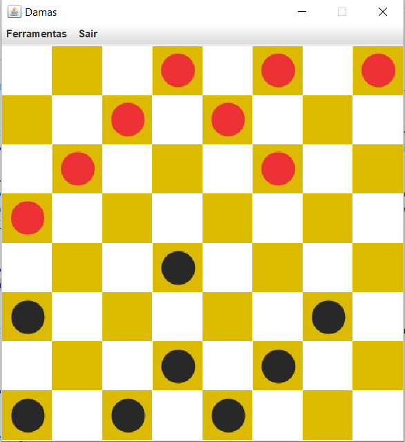

# Jogo de Damas

Projeto desenvolvivo de um popular jogo de tabuleiro chamado Damas.
O jogo possui funcionalidade multiplayer e uma função para jogar contra o computador. Projeto desenvolvido utilizando a linguagem JAVA.

